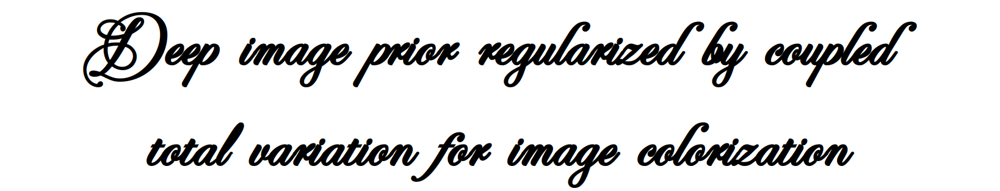
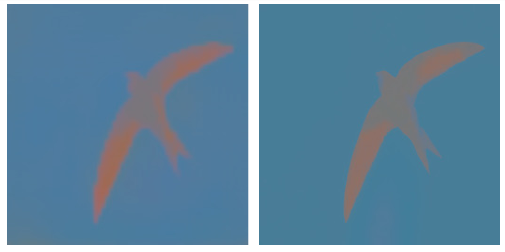
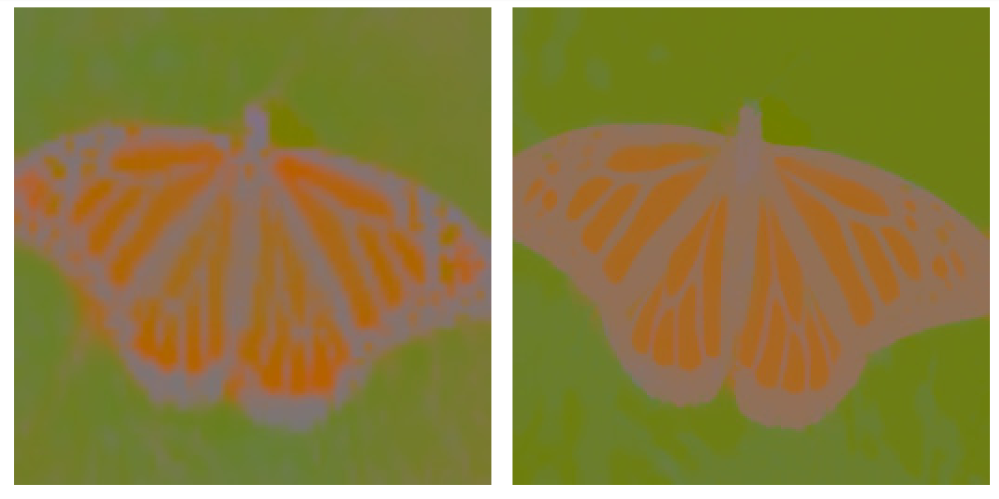
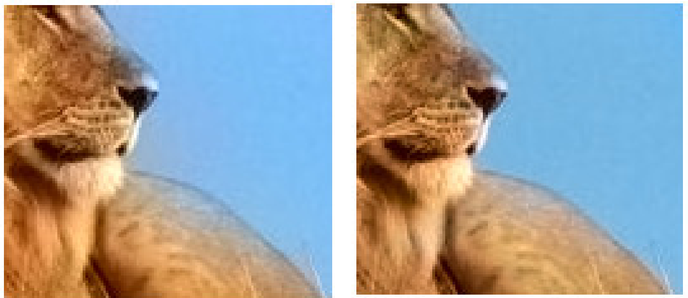
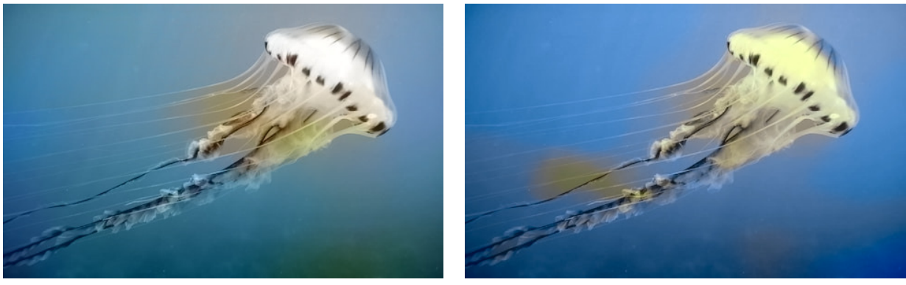

<p align="center">
  
</p>

[](https://www.python.org/downloads/release/python-31111/)
[](https://pytorch.org/docs/2.5/)

[](https://pylint.pycqa.org/en/latest/)
[](https://docs.astral.sh/ruff/formatter/)

This code allows to reproduce the results of this [paper](https://hal.science/hal-04035467). 
It compares the result given by Zhang *et al.* in the EECV paper [Colorful Image Colorization](https://richzhang.github.io/colorization/).


## Installation
A script is available for an easy creation of the conda environment and compilation of auxiliary functions:
```bash
$ source install.bash
```

## How to use

An example can be found in the `main.py`. 

* Here are the chrominances channel for 2 images (Zhang *et al.* on the left and our method on the right). Out procedure allows recovering sharp contours.

<p align="center">
  
<!-- </p>
<p align="center"> -->
  
</p>

* In the real images, our algorithm allows correcting halos created in the CNN of Zhang *et al.* and recover more realistic colors contained in the predicted probability distribution of Zhang *et al.*.

<p align="center">
  
<!-- </p>
<p align="center"> -->
  
</p>

## Interesting ? 

If you have any questions, feel free to contact us. We will be more than happy to answer ! 😀

If you use it, a reference to the paper would be highly appreciated.

```
@InProceedings{10.1007/978-3-031-31975-4_23,
author="Agazzotti, Gaetano
and Pierre, Fabien
and Sur, Fr{\'e}d{\'e}ric",
editor="Calatroni, Luca
and Donatelli, Marco
and Morigi, Serena
and Prato, Marco
and Santacesaria, Matteo",
title="Deep Image Prior Regularized by Coupled Total Variation for Image Colorization",
booktitle="Scale Space and Variational Methods in Computer Vision",
year="2023",
publisher="Springer International Publishing",
address="Cham",
pages="301--313",
isbn="978-3-031-31975-4"
}

```


## Tested on

[](https://www.releases.ubuntu.com/24.04/)
[](https://docs.conda.io/projects/conda/en/24.9.x/)


[](https://developer.nvidia.com)
[](https://ark.intel.com/content/www/fr/fr/ark/products/196449/intel-core-i7-10510u-processor-8m-cache-up-to-4-90-ghz.html)

